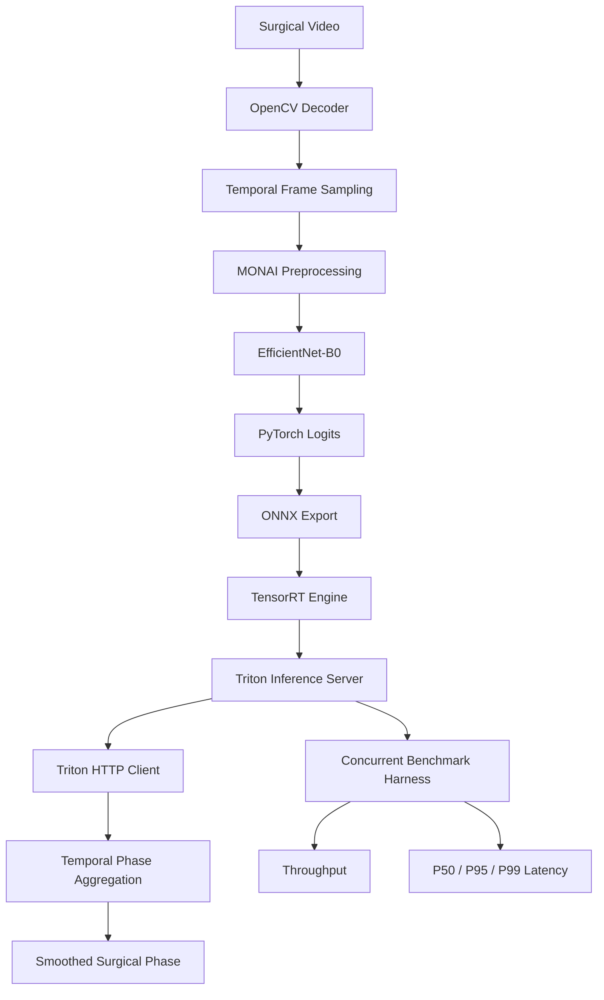

# Real-Time Surgical Video Inference

A production-oriented medical video inference pipeline for **surgical phase recognition** built with PyTorch, MONAI, ONNX, TensorRT, and NVIDIA Triton Inference Server.

The project uses the Cholec80 laparoscopic cholecystectomy task and models surgical workflow as a seven-class phase-recognition problem.

The system is designed as an end-to-end inference stack:

```text
Surgical Video
      │
      ▼
OpenCV decoding
      │
      ▼
Temporal frame sampling
      │
      ▼
MONAI preprocessing
      │
      ▼
EfficientNet-B0 / PyTorch
      │
      ▼
ONNX
      │
      ▼
TensorRT
      │
      ▼
Triton Inference Server
      │
      ▼
Temporal smoothing
      │
      ▼
Surgical phase prediction
```

The repository includes training, evaluation, model export, TensorRT deployment tooling, Triton serving configuration, streaming inference, and concurrent performance benchmarking.

---

## Why This Project

Real-time medical video systems require more than model accuracy.

A production inference pipeline must also address:

- deterministic preprocessing
- video decoding and sampling
- temporal stability
- portable model export
- accelerator-specific optimization
- model serving
- concurrent request handling
- latency and throughput measurement
- reproducible deployment

This project treats surgical phase recognition as an **inference systems problem**, not only a classification problem.

---

## Surgical Phases

The pipeline recognizes seven Cholec80 surgical phases:

| ID | Phase |
|---:|---|
| 0 | Preparation |
| 1 | CalotTriangleDissection |
| 2 | ClippingCutting |
| 3 | GallbladderDissection |
| 4 | GallbladderRetraction |
| 5 | CleaningCoagulation |
| 6 | GallbladderPackaging |

---

## Architecture



A more detailed architecture description is available in [`docs/architecture.md`](docs/architecture.md).

---

## Repository Structure

```text
real-time-surgical-inference/
├── src/
│   └── surgphase/
│       ├── annotations.py
│       ├── benchmarking.py
│       ├── dataset.py
│       ├── device.py
│       ├── evaluation.py
│       ├── manifest.py
│       ├── model.py
│       ├── onnx_export.py
│       ├── preprocessing.py
│       ├── streaming.py
│       ├── temporal.py
│       ├── tensorrt_tools.py
│       ├── training.py
│       ├── triton_client.py
│       ├── triton_repository.py
│       └── video.py
│
├── scripts/
│   ├── benchmark_streaming.py
│   ├── benchmark_tensorrt.py
│   ├── build_manifest.py
│   ├── build_tensorrt.py
│   ├── evaluate.py
│   ├── export_onnx.py
│   ├── prepare_triton_repo.py
│   ├── run_perf_analyzer.sh
│   ├── run_tensorrt_container.sh
│   ├── run_triton_server.sh
│   ├── stream_triton.py
│   └── train.py
│
├── tests/
├── benchmarks/
├── docs/
└── pyproject.toml
```

---

## Pipeline

### 1. Annotation Parsing

Cholec80 phase annotations are parsed into strongly typed records containing:

- frame number
- phase name
- phase index

Invalid phase names, malformed frames, and malformed annotation files are rejected during ingestion.

---

### 2. Dataset Manifest

Annotations and corresponding videos are converted into a reproducible manifest.

The split is performed at the **video level** rather than frame level to avoid leakage between highly correlated frames from the same surgery.

Current split:

```text
Videos 01–32 → training
Videos 33–40 → validation
Videos 41–80 → testing
```

Annotation timestamps are derived from the Cholec80 annotation rate.

---

### 3. Video Sampling

OpenCV provides:

- video metadata inspection
- random frame access
- RGB frame decoding
- configurable temporal sampling

Frames are converted from OpenCV BGR to RGB before model preprocessing.

---

### 4. MONAI Preprocessing

Each frame is transformed into:

```text
3 × 224 × 224
```

using a deterministic MONAI pipeline:

```text
HWC RGB uint8
      │
      ▼
CHW
      │
      ▼
[0, 1] scaling
      │
      ▼
224 × 224 resize
      │
      ▼
ImageNet normalization
      │
      ▼
FP32 tensor
```

The same preprocessing contract is used during training and streaming inference.

---

### 5. Surgical Phase Classifier

The classifier uses MONAI's EfficientNet-B0 implementation with:

```text
Input
N × 3 × 224 × 224

Output
N × 7
```

The model code is device-independent and supports:

- CUDA
- Apple MPS
- CPU

depending on available hardware.

---

### 6. Training and Evaluation

The repository includes:

- PyTorch DataLoader integration
- cross-entropy training
- AdamW optimization
- validation loops
- checkpoint saving
- checkpoint restoration
- per-phase precision
- per-phase recall
- per-phase F1
- macro metrics
- confusion matrices

Checkpoint selection is based on validation loss.

---

### 7. Temporal Phase Aggregation

Single-frame predictions can fluctuate even when the underlying surgical workflow changes slowly.

The streaming pipeline therefore maintains a rolling temporal window:

```text
Frame logits
    │
    ├── t-4
    ├── t-3
    ├── t-2
    ├── t-1
    └── t
        │
        ▼
   mean logits
        │
        ▼
     softmax
        │
        ▼
 smoothed phase
```

This separates:

```text
raw frame prediction
```

from:

```text
temporally stabilized prediction
```

---

## ONNX Export

The PyTorch classifier can be exported to ONNX with a dynamic batch dimension.

Install the ONNX dependencies:

```bash
python -m pip install -e ".[dev,onnx]"
```

Export a checkpoint:

```bash
python scripts/export_onnx.py \
  --checkpoint models/best_model.pt \
  --output models/surgical_phase.onnx
```

The export pipeline performs:

- ONNX model validation
- dynamic batch configuration
- ONNX Runtime execution
- PyTorch vs ONNX numerical parity checking

---

## TensorRT

TensorRT execution requires an NVIDIA CUDA environment.

The repository provides tooling for generating TensorRT build commands and benchmarking engines while keeping local development independent of CUDA.

Inspect the TensorRT build command without executing it:

```bash
python scripts/build_tensorrt.py \
  --onnx models/surgical_phase.onnx \
  --dry-run
```

Example deployment shape profile:

```text
min batch: 1
opt batch: 8
max batch: 32

input:
N × 3 × 224 × 224
```

On an NVIDIA Linux host, enter the TensorRT environment:

```bash
./scripts/run_tensorrt_container.sh
```

Build the engine:

```bash
python scripts/build_tensorrt.py \
  --onnx models/surgical_phase.onnx \
  --engine models/surgical_phase.plan
```

Benchmark it:

```bash
python scripts/benchmark_tensorrt.py \
  --engine models/surgical_phase.plan \
  --batch-size 1 \
  --output benchmarks/results/tensorrt_batch1.json
```

The benchmark parser records:

- throughput
- mean latency
- median latency
- p95 latency
- p99 latency

---

## Triton Inference Server

The TensorRT engine can be packaged into a Triton model repository.

Generate the repository:

```bash
python scripts/prepare_triton_repo.py \
  --engine models/surgical_phase.plan
```

Result:

```text
deployment/
└── model_repository/
    └── surgical_phase/
        ├── config.pbtxt
        └── 1/
            └── model.plan
```

The configuration exposes:

```text
Input:
FP32 [N, 3, 224, 224]

Output:
FP32 [N, 7]
```

and enables Triton dynamic batching.

Start Triton on an NVIDIA Linux host:

```bash
./scripts/run_triton_server.sh
```

The server exposes the inference service through Triton's standard HTTP/gRPC interfaces.

---

## Streaming Inference

The streaming client connects decoded surgical frames to Triton:

```text
video
  │
  ▼
sample frame
  │
  ▼
MONAI preprocessing
  │
  ▼
HTTP inference
  │
  ▼
TensorRT logits
  │
  ▼
temporal smoothing
  │
  ▼
phase prediction
```

Run:

```bash
python scripts/stream_triton.py \
  --video /path/to/video41.mp4 \
  --sample-fps 1 \
  --temporal-window 5
```

Example output format:

```text
t=   45.00s frame=   1125 |
raw=ClippingCutting |
smoothed=ClippingCutting |
triton=<measured latency> ms
```

No benchmark values are hard-coded into the project.

---

## Concurrent Streaming Benchmark

The project includes an application-level benchmark for multiple concurrent surgical streams.

Example:

```bash
python scripts/benchmark_streaming.py \
  --video /path/to/video41.mp4 \
  --concurrency 4 \
  --requests-per-stream 100 \
  --output benchmarks/results/stream_c4.json
```

The benchmark reports:

```text
total requests
wall-clock duration
throughput
Triton request latency
end-to-end frame latency
```

Latency distributions include:

```text
mean
p50
p95
p99
```

The benchmark intentionally preloads decoded RGB frames so disk I/O and OpenCV seeking are not included in the inference serving measurements.

---

## NVIDIA Performance Analyzer

The repository also includes a wrapper around Triton's official Performance Analyzer.

On an NVIDIA/Linux deployment environment:

```bash
./scripts/run_perf_analyzer.sh
```

This provides an independent server-side concurrency sweep that can be compared with the application's own streaming benchmark.

---

## Benchmark Methodology

Two latency measurements are intentionally tracked separately.

### Triton request latency

```text
client request
      ↓
HTTP
      ↓
Triton
      ↓
TensorRT
      ↓
response
```

This isolates the model-serving path.

### End-to-end frame latency

```text
RGB frame
   ↓
MONAI preprocessing
   ↓
Triton request
   ↓
TensorRT
   ↓
response parsing
   ↓
temporal aggregation
```

This measures the application-visible inference path.

See [`benchmarks/README.md`](benchmarks/README.md) for the complete benchmark protocol.

---

## Current Validation Status

| Component | Status |
|---|---|
| Annotation parser | ✅ Implemented and tested |
| Dataset manifest | ✅ Implemented and tested |
| OpenCV frame sampling | ✅ Implemented and tested |
| MONAI preprocessing | ✅ Implemented and tested |
| EfficientNet-B0 classifier | ✅ Implemented and tested |
| Training loop | ✅ Implemented and tested |
| Checkpoint loading | ✅ Implemented and tested |
| Classification evaluation | ✅ Implemented and tested |
| Temporal inference | ✅ Implemented and tested |
| ONNX export | ✅ Implemented and tested |
| ONNX Runtime parity validation | ✅ Implemented and tested |
| TensorRT build tooling | ✅ Implemented and locally validated |
| TensorRT GPU execution | ⏳ Requires NVIDIA GPU |
| Triton model repository | ✅ Implemented and tested |
| Triton HTTP client | ✅ Implemented and tested |
| Streaming pipeline | ✅ Implemented and tested |
| Concurrent benchmark harness | ✅ Implemented and tested |
| NVIDIA GPU performance results | ⏳ Pending NVIDIA execution |

---

## Test Suite

Run:

```bash
python -m pytest
```

Current validated test suite:

```text
77 passed
```

Lint:

```bash
ruff check .
```

Expected:

```text
All checks passed!
```

Tests cover:

- annotation validation
- manifests
- video decoding
- preprocessing
- dataset loading
- classifier behavior
- training
- checkpoint restoration
- evaluation metrics
- temporal inference
- ONNX export
- PyTorch/ONNX parity
- TensorRT command generation
- TensorRT benchmark parsing
- Triton repository creation
- Triton HTTP requests
- streaming inference
- concurrent benchmark metrics

---

## Local Development

### Create the environment

```bash
python3.12 -m venv .venv
source .venv/bin/activate
```

Install development dependencies:

```bash
python -m pip install --upgrade pip

python -m pip install -e \
  ".[dev,onnx,triton]"
```

Verify:

```bash
python -m pytest
ruff check .
```

---

## Build the Cholec80 Manifest

The dataset itself is not committed to this repository.

Assuming:

```text
data/
├── annotations/
└── videos/
```

build the manifest with:

```bash
python scripts/build_manifest.py \
  --annotations data/annotations \
  --videos data/videos \
  --output data/cholec80_manifest.csv
```

---

## Train

Example:

```bash
python scripts/train.py \
  --manifest data/cholec80_manifest.csv \
  --epochs 10 \
  --batch-size 16 \
  --learning-rate 1e-4 \
  --sample-fps 1 \
  --checkpoint models/best_model.pt
```

For CLI details:

```bash
python scripts/train.py --help
```

---

## Hardware Portability

The project intentionally separates development from deployment.

### macOS / Apple Silicon

Supported for:

- preprocessing
- model development
- unit tests
- MPS inference
- ONNX export
- ONNX Runtime validation
- TensorRT command generation
- Triton configuration generation
- mocked streaming tests
- benchmark logic tests

### NVIDIA Linux

Required for:

- CUDA inference
- TensorRT engine generation
- TensorRT performance measurements
- TensorRT-backed Triton serving
- Triton concurrency measurements

This allows the same application codebase to be developed locally while keeping NVIDIA-specific execution isolated to the deployment environment.

---

## Performance Results

Actual NVIDIA GPU measurements will be added only after executing the benchmark suite on a CUDA-capable system.

| Metric | Result |
|---|---:|
| TensorRT batch-1 throughput | Pending |
| TensorRT batch-1 mean latency | Pending |
| TensorRT batch-1 p95 latency | Pending |
| TensorRT batch-1 p99 latency | Pending |
| Concurrent stream throughput | Pending |
| End-to-end p50 latency | Pending |
| End-to-end p95 latency | Pending |
| End-to-end p99 latency | Pending |

This repository intentionally does not report simulated or estimated GPU performance.

---

## Engineering Focus

The project demonstrates work across:

- Python
- PyTorch
- MONAI
- OpenCV
- medical video processing
- model training and evaluation
- temporal inference
- ONNX
- ONNX Runtime
- TensorRT deployment tooling
- NVIDIA Triton Inference Server
- HTTP model serving
- dynamic batching
- concurrent inference
- latency benchmarking
- throughput benchmarking
- testable systems design

---

## Project Status

Core implementation is complete.

The remaining deployment milestone is to run the existing TensorRT and Triton benchmark suite on NVIDIA hardware and publish measured performance results.
